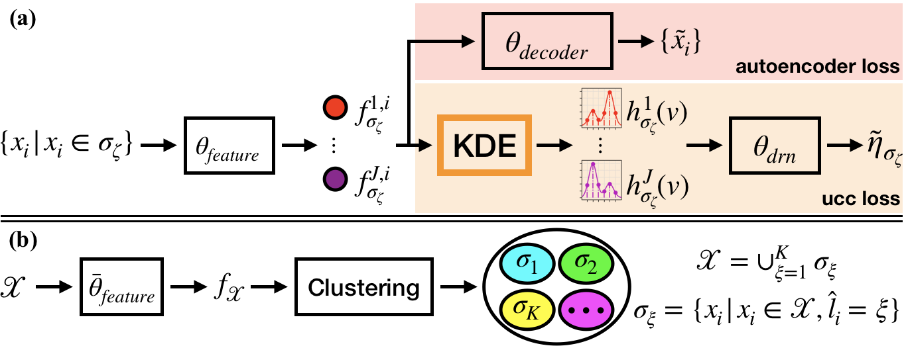

## Description

Pytorch implementation for ICLR 2020 paper "Weakly Supervised Clustering by Exploiting Unique Class Count"

Achieved 75% test accuracy on CIFAR-10.

Completed as part of CS5242 coursework at National University of Singapore.
